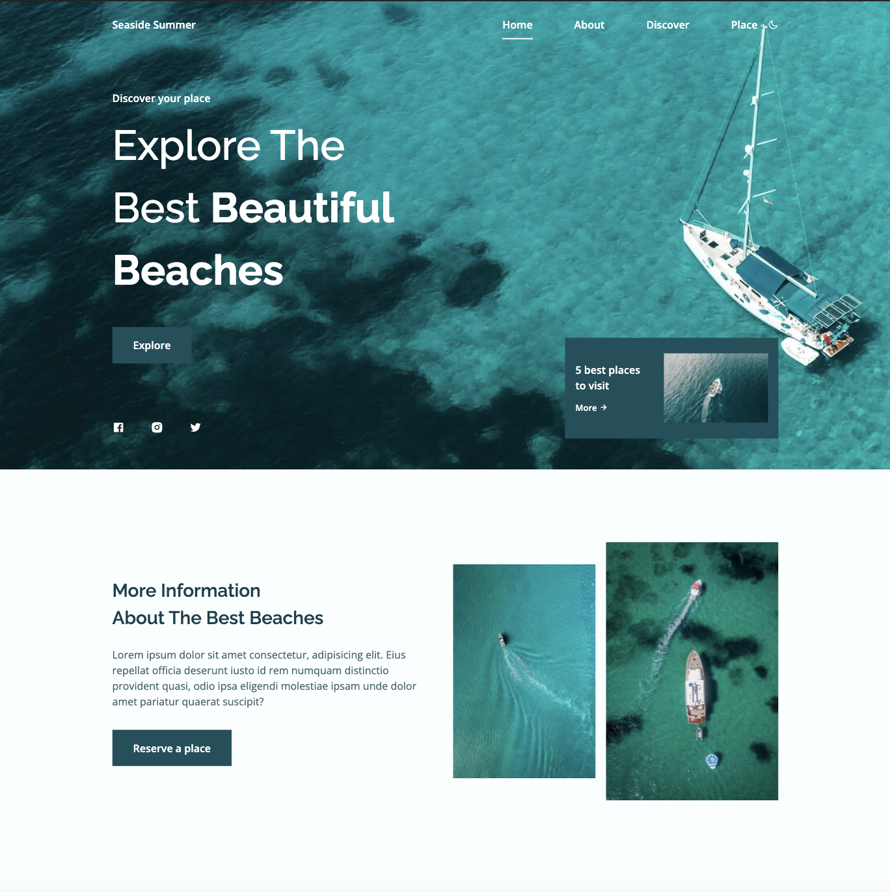
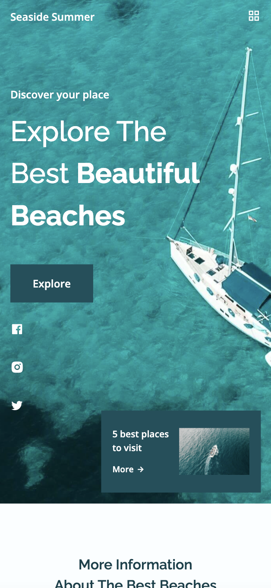

# Seaside-Summer

Responsive landing page website. Special thanks to Bedimcode for the tutorial.

Link for the tutorial: [Responsive Travel Website Design Using HTML CSS and JavaScript 🌊 | Dark/Light Mode](https://youtu.be/YzRDHxbw1RU)

### Features:

- Reponsive
- Grid
- Animation
- Mobile first

### Live version:

[Seaside Summer](https://happy-leavitt-1b9517.netlify.app/)

### Screenshot:

Thanks!
